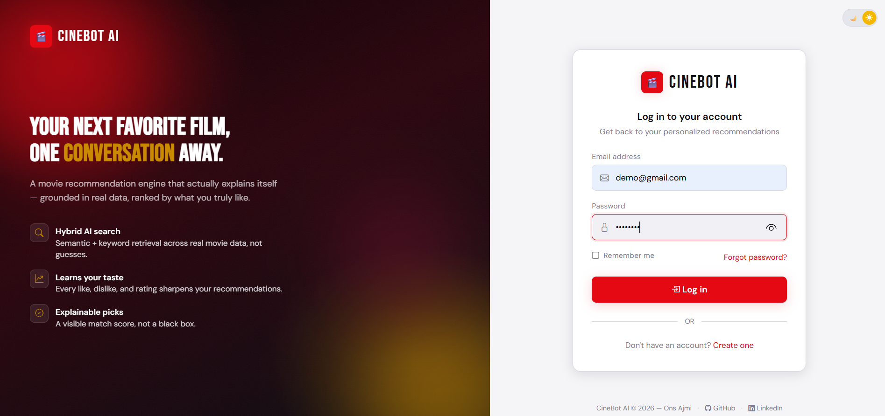
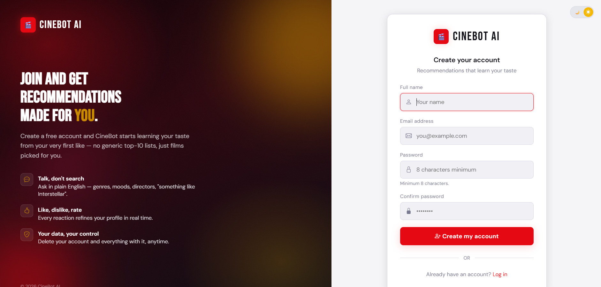
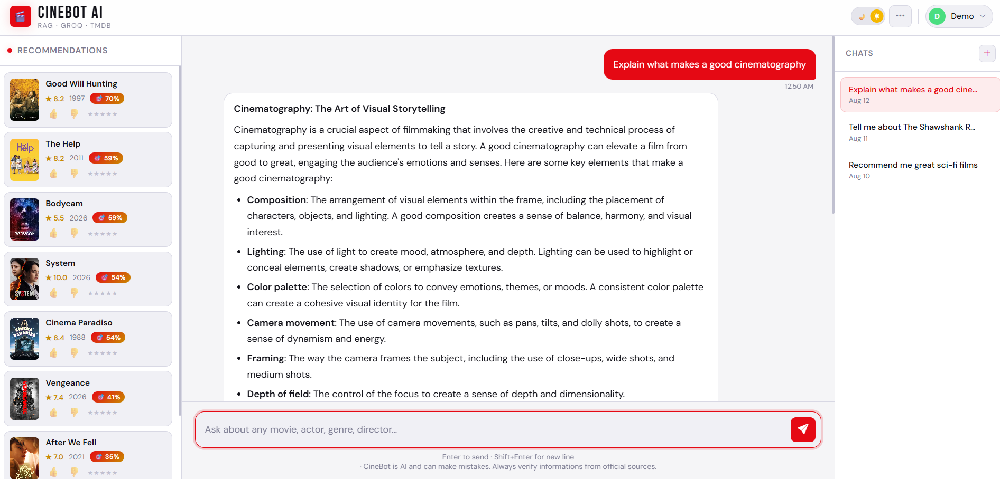
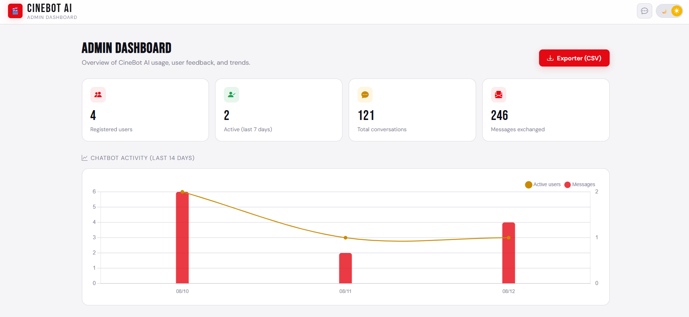
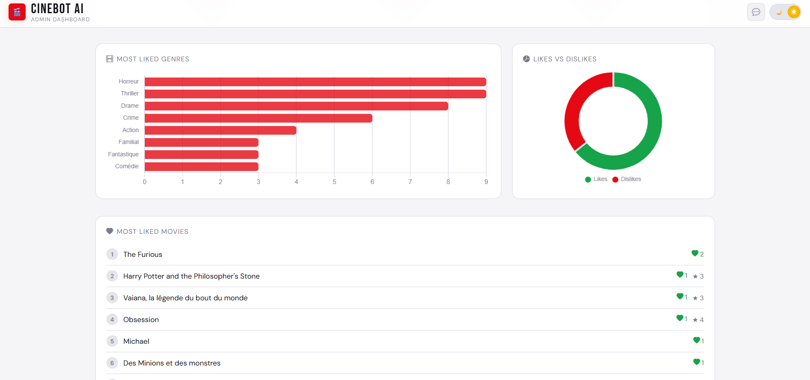
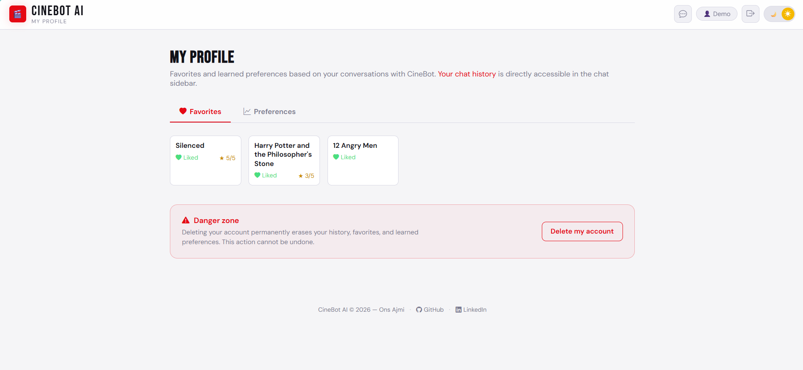

# 🎬 CineBot AI

**Intelligent movie assistant** combining a hybrid RAG architecture (dense + sparse retrieval), an LLM (Groq / Llama 3.1) and real-time TMDB data, to deliver personalized, explained and verifiable movie recommendations.

Summer internship project — 1st year Engineering Cycle, TEK-UP University.

----

## Table of Contents

- [Overview](#overview)
- [Screenshots](#screenshots)
- [Features](#features)
- [Architecture](#architecture)
- [Tech Stack](#tech-stack)
- [Project Structure](#project-structure)
- [Prerequisites](#prerequisites)
- [Installation](#installation)
- [Quick Start with Docker](#quick-start-with-docker)
- [Environment Variables](#environment-variables)
- [Running the Project](#running-the-project)
- [Database Schema](#database-schema)
- [API Reference](#api-reference)
- [Interactive Documentation (Swagger)](#interactive-documentation-swagger)
- [Cache & Performance](#cache--performance)
- [Logs & Observability](#logs--observability)
- [Automated Tests](#automated-tests)
- [Security & Account Management](#security--account-management)
- [Becoming an Administrator](#becoming-an-administrator)
- [Roadmap](#roadmap)
- [Contributing](#contributing)
- [License](#license)

---

## Overview

CineBot AI is a full-stack movie chatbot that does more than just query an LLM: every answer is **grounded** in real data (TMDB) through a hybrid retrieval pipeline, then **re-ranked** by a ranking engine that takes each user's learned tastes into account, before Groq writes the final explanation.

## Screenshots

<table>
<tr>
<td width="50%"></td>
<td width="50%"></td>
</tr>
<tr>
<td align="center"><sub><b>Login</b> — split-screen layout with branded panel</sub></td>
<td align="center"><sub><b>Register</b> — matching onboarding experience</sub></td>
</tr>
</table>

<table>
<tr>
<td></td>
</tr>
<tr>
<td align="center"><sub><b>Main chat interface</b> — hybrid RAG recommendations with visible match-score badges and conversation history</sub></td>
</tr>
</table>

<table>
<tr>
<td width="50%"></td>
<td width="50%"></td>
</tr>
<tr>
<td align="center"><sub><b>Admin dashboard</b> — usage activity (Chart.js)</sub></td>
<td align="center"><sub><b>Admin dashboard</b> — feedback breakdown & top content</sub></td>
</tr>
</table>

<table>
<tr>
<td></td>
</tr>
<tr>
<td align="center"><sub><b>User profile</b> — favorites and learned taste preferences</sub></td>
</tr>
</table>
```
"Recommend me a good science-fiction movie"
        │
        ▼
┌───────────────────────────────────────────────────────────┐
│  1. Hybrid retrieval: FAISS (dense) + BM25 (sparse)        │
│     merged using Reciprocal Rank Fusion                     │
│  2. TMDB enrichment (rating, popularity, genres, cast)      │
│  3. Hybrid ranking: relevance + rating + popularity          │
│     + learned preferences (real likes/dislikes/ratings)     │
│  4. Groq (Llama 3.1) writes the personalized explanation     │
└───────────────────────────────────────────────────────────┘
        │
        ▼
   Answer + ranked movie cards, with 👍 👎 ⭐ to keep refining
   the user's profile
```

## Features

- **Conversational chat** with anaphora resolution ("tell me about the first one", "same director as him")
- **Multiple conversations** Claude/ChatGPT-style: history in a sidebar, "New conversation" button
- **Complete authentication**: registration, login, logout, **password recovery**, **account deletion** (Laravel sessions)
- **Real user profiling**: preferred genres, actors, directors and languages, learned from interactions (enriched via the TMDB API, not simple keyword matching)
- **Feedback Learning**: 👍 / 👎 / ⭐ (1 to 5) on every recommendation, which updates the profile in real time
- **Hybrid ranking engine** combining RAG relevance, TMDB rating, popularity and learned preferences — with a "🎯 XX% match" badge displayed on each recommendation to make the score visible, not just functional behind the scenes
- **Admin dashboard**: active users, most appreciated genres, most liked movies, chatbot usage, feedback statistics, **one-click CSV export**
- **Application security**: rate limiting on sensitive endpoints, password confirmation for destructive actions, GDPR-compliant handling of personal data
- **Light / dark theme** synchronized across all pages
- **Multi-level adult content filtering** (TMDB, RAG documents, system prompt)

## Architecture

The project is made up of **two independent services** that communicate over HTTP:

```
┌───────────────┐      HTTP/JSON       ┌────────────────────┐      HTTP      ┌──────────┐
│   Frontend     │ ───────────────────▶ │   Laravel Backend   │ ─────────────▶ │ Groq API  │
│  Blade + JS    │ ◀─────────────────── │   (PHP / MySQL)      │                └──────────┘
└───────────────┘                      └──────────┬──────────┘
                                                   │ HTTP/JSON
                                                   ▼
                                        ┌─────────────────────┐      HTTP      ┌──────────┐
                                        │  Python AI Service    │ ─────────────▶ │ TMDB API  │
                                        │  FastAPI + FAISS      │                └──────────┘
                                        └─────────────────────┘
```

- **Laravel** handles authentication, persistence (history, favorites, preferences), and acts as a secure proxy to the Python service (no API key is ever exposed to the browser).
- **FastAPI** handles the RAG pipeline (FAISS + BM25), the hybrid ranking, and the call to Groq.
- The two services communicate only through `AI_API_URL` — they can be deployed separately.

## Tech Stack

| Layer | Technology |
|---|---|
| Frontend | Blade (PHP templating), vanilla JavaScript, custom CSS |
| Application backend | Laravel 12 (PHP 8.2+), MySQL |
| AI service | FastAPI (Python), Uvicorn |
| Vector search | FAISS + `sentence-transformers/all-MiniLM-L6-v2` |
| Lexical search | BM25 (`rank_bm25`) |
| LLM | Groq API — `llama-3.1-8b-instant` |
| Movie data | TMDB API |
| Local environment | XAMPP (Apache/MySQL) |
| Containerization | Docker Compose (Laravel + MySQL + AI service) |

## Project Structure

```
cinebot-ai/
├── app/
│   ├── Http/
│   │   ├── Controllers/
│   │   │   ├── Auth/AuthController.php        # registration / login / logout
│   │   │   ├── Admin/AdminDashboardController.php
│   │   │   ├── CinebotController.php          # proxy to the AI service, history
│   │   │   └── MovieFeedbackController.php    # like/dislike/rating, favorites, preferences
│   │   └── Middleware/EnsureIsAdmin.php
│   ├── Models/
│   │   ├── User.php
│   │   ├── ChatHistory.php
│   │   ├── UserPreference.php                 # learned profile (bump/topFor)
│   │   └── MovieInteraction.php
│   └── Services/TmdbClient.php                # TMDB enrichment on the Laravel side
├── database/migrations/
├── resources/views/
│   ├── auth/{login,register,forgot-password,reset-password}.blade.php
│   ├── admin/dashboard.blade.php
│   ├── chatbot.blade.php                      # main interface
│   └── profile.blade.php                      # favorites, preferences, account deletion
├── routes/{web.php,api.php}
├── docker/entrypoint.sh                       # waits for MySQL, migrates, starts Laravel
├── Dockerfile                                  # Laravel image (PHP 8.2 + artisan serve)
├── docker-compose.yml                          # orchestrates Laravel + MySQL + AI service
├── ai-service/                                # independent Python service
│   ├── main.py            # FastAPI endpoints (/chat, /recommendations, /trending)
│   ├── rag_engine.py      # TMDB ingestion, FAISS + BM25 index, hybrid retrieval
│   ├── ranking.py          # hybrid ranking engine (relevance + rating + pop + prefs)
│   ├── groq_service.py     # prompt engineering + Groq call
│   ├── tmdb_service.py     # real-time TMDB search
│   ├── memory.py           # per-session conversational memory
│   ├── requirements.txt    # pinned Python dependencies
│   ├── Dockerfile          # AI service image (Python 3.11 + FAISS)
│   └── faiss_movie_index/  # persistent vector index (generated, not versioned)
└── .env / .env.example
```

## Prerequisites

- PHP ≥ 8.2, Composer
- MySQL ≥ 8.0 (or equivalent MariaDB)
- Python ≥ 3.10, pip
- A [Groq API](https://console.groq.com) key (free)
- A [TMDB API](https://www.themoviedb.org/settings/api) key (free)

## Installation

### 1. Clone the repository

```bash
git clone https://github.com/AjmiOns/CineBot-AI.git
cd CineBot-AI
```

### 2. Laravel backend

```bash
composer install
copy .env.example .env        # cp .env.example .env on Linux/Mac
php artisan key:generate
```

Configure `DB_*` in `.env`, then:

```bash
php artisan migrate
```

### 3. AI service (Python)

```bash
cd ai-service
python -m venv venv
venv\Scripts\activate          # source venv/bin/activate on Linux/Mac
pip install -r requirements.txt
```

## Quick Start with Docker

An alternative to the manual installation above: the 3 services (Laravel, MySQL, AI service) start with a single command, with the right versions and without depending on the local machine's configuration (XAMPP, PHP/Python versions, etc.).

**Prerequisites**:
- [Docker Desktop](https://www.docker.com/products/docker-desktop/) installed and running (on Windows, requires WSL 2 — `wsl --install` then restart if it is not already enabled)
- `.env` (root) and `ai-service/.env` already filled in with your keys (see [Environment Variables](#environment-variables)) — Docker Compose does not generate them for you

```bash
docker compose up --build
```

The very first launch is slow (5-15 min depending on your connection): downloading base images, installing PHP/Python dependencies, and downloading the HuggingFace embedding model. Subsequent launches are much faster thanks to the Docker cache.

| Service | URL |
|---|---|
| Laravel application | `http://localhost:8000` |
| AI service (Swagger) | `http://localhost:8001/docs` |
| MySQL (host side, if direct access is needed) | `localhost:3307` *(3307 to avoid conflicting with a local MySQL already on 3306, e.g. XAMPP)* |

What `docker compose up` does automatically:
- Builds the Laravel image (PHP 8.2 + extensions) and the AI service image (Python 3.11 + FAISS/sentence-transformers)
- Waits for MySQL to be ready (`healthcheck`) before starting Laravel
- Applies migrations (`php artisan migrate --force`) when the Laravel container starts
- Persists the MySQL database and the FAISS index in named Docker volumes, so nothing has to be rebuilt on every restart

⚠️ **Isolated database** — the MySQL container starts with an **empty database, completely separate** from the one used locally (XAMPP). User accounts created in one environment do not exist in the other: you need to recreate an account via `/register` (or reimport an SQL dump) after the first `docker compose up`.

To stop:
```bash
docker compose down
```

To start from scratch (also deletes the volumes — database and FAISS index):
```bash
docker compose down -v
```

## Environment Variables

**`.env` (Laravel, at the root)**

| Variable | Description |
|---|---|
| `DB_DATABASE`, `DB_USERNAME`, `DB_PASSWORD` | MySQL connection |
| `AI_API_URL` | URL of the Python service (e.g. `http://127.0.0.1:8001`) |
| `TMDB_API_KEY` | Used for profile enrichment (genres/actors/directors) |

**`ai-service/.env`**

| Variable | Description |
|---|---|
| `GROQ_API_KEY` | Groq API key |
| `TMDB_API_KEY` | TMDB key (real-time search + RAG index construction) |

## Running the Project

Two processes must run in parallel, in two separate terminals:

```bash
# Terminal 1 — Laravel backend
php artisan serve

# Terminal 2 — AI service
cd ai-service
uvicorn main:app --port 8001 --reload
```

On first startup, `uvicorn` automatically builds the FAISS index if it is missing (this can take a few minutes depending on the number of movies configured in `build_index()`).

Then go to `http://localhost:8000`.

## Database Schema

| Table | Purpose |
|---|---|
| `users` | User accounts (+ `is_admin`, `preferred_language`) |
| `chat_histories` | Messages, grouped by `session_id` (one conversation) |
| `user_preferences` | Learned profile: `preference_key` (genre/actor/director/language) × `preference_value` × `score` |
| `movie_interactions` | One row per (user, movie): `liked`, `rating`, `watched_at` |

## API Reference

All `/api/*` routes require an authenticated session (except `/api/chat` and `/api/recommendations`, which are accessible to guests with reduced functionality).

| Method | Route | Description |
|---|---|---|
| `POST` | `/api/chat` | Sends a message, receives an answer + ranked recommendations *(limited to 20 req/min)* |
| `GET` | `/api/chat/sessions` | List of the user's conversations |
| `GET` | `/api/chat/sessions/{id}` | Messages of a specific conversation |
| `DELETE` | `/api/chat/sessions/{id}` | Deletes a conversation |
| `POST` | `/api/movies/feedback` | Records a like / dislike / rating on a movie |
| `GET` | `/api/user/favorites` | Liked movies |
| `GET` | `/api/user/preferences` | Learned profile (genres/actors/directors) |
| `GET` | `/api/admin/stats` | Global statistics (admin only) |
| `GET` | `/admin/export` | CSV export of statistics (admin only) |

Web routes related to authentication (outside `/api`):

| Method | Route | Description |
|---|---|---|
| `GET/POST` | `/forgot-password` | Password reset request *(limited to 5 req/min)* |
| `GET/POST` | `/reset-password/{token}` | Applying the new password |
| `DELETE` | `/profile` | Deletion of the account and all its data |

## Interactive Documentation (Swagger)

The AI service exposes its OpenAPI documentation, automatically generated by FastAPI — no manual maintenance required:

- **Swagger UI** (interactive, directly testable): `http://127.0.0.1:8001/docs`
- **ReDoc** (reading): `http://127.0.0.1:8001/redoc`
- **Raw OpenAPI schema**: `http://127.0.0.1:8001/openapi.json`

Useful for exploring `/chat`, `/recommendations/{user_id}` and `/trending` without going through the Laravel frontend.

## Cache & Performance

Two endpoints prone to repeated TMDB calls are cached on the Laravel side (`Cache::remember`, driver configured via `CACHE_STORE`):

| Endpoint | Cache scope | Duration | Rationale |
|---|---|---|---|
| `GET /api/trending` | Global (all users) | 60 min | Same content for everyone, changes slowly |
| `GET /api/recommendations/{id}` | Per user + taste profile (key includes a hash of the preferences) | 15 min | Personalized, but must stay fresh after a new like/dislike |

Failures (AI service or TMDB unavailable) are **never** cached, so that a user is not deprived of recommendations for the entire TTL after a transient outage that has already been resolved.

## Logs & Observability

Communication failures with the AI service (FastAPI), Groq and TMDB are written to a dedicated channel, separate from Laravel's generic application logs:

```
storage/logs/cinebot-{date}.log
```

Configured in `config/logging.php` (`daily` driver, 14-day rotation). To follow these logs live during a demo:

```bash
tail -f storage/logs/cinebot-$(date +%Y-%m-%d).log
```

## Automated Tests

```bash
php artisan test
```

Feature test suite (PHPUnit, isolated on in-memory SQLite — see `phpunit.xml`, no data from the development MySQL database is touched):

| File | Covers |
|---|---|
| `tests/Feature/Auth/AuthenticationTest.php` | Registration, login, logout, route protection, forgotten password, account deletion |
| `tests/Feature/MovieFeedbackTest.php` | Like / dislike / rating, input validation, upsert (no duplicates), guest access denied, favorites |

Network calls to TMDB are intercepted (`Http::fake()`) — the suite runs entirely offline and deterministically.

## Security & Account Management

The project applies several hardening measures beyond basic authentication:

- **Password recovery** — native Laravel flow (`Password::sendResetLink` / `Password::reset`), single-use token expiring after 60 minutes. The returned message is deliberately generic ("if an account exists...") so that it never confirms whether an email address is registered (protection against account enumeration).
- **Rate limiting**:
  - `/api/chat`: 20 requests/minute per user (or per IP for guests) — protects the Groq/TMDB bill and the AI service against abuse or frontend loops.
  - `/forgot-password`: 5 requests/minute — anti-spam on email sending.
- **Account deletion (right to be forgotten)** — accessible from `/profile`, "Danger zone" section. Password confirmation is required before deletion. The deletion is executed in an SQL transaction and erases: the conversation history, the learned preferences, the movie interactions (favorites/ratings), then the account itself.
- **Unversioned secrets** — `.env`, `ai-service/.env`, as well as the generated FAISS index (`ai-service/faiss_movie_index/`) are excluded from the repository via `.gitignore`. The Groq and TMDB keys never reach the browser: all external calls go through the backend.
- **CSRF** — all `/api/*` routes share the web session (see `bootstrap/app.php`) and validate the CSRF token, including for the frontend's `fetch()` calls.

## Becoming an Administrator

```bash
php artisan tinker
```
```php
User::where('email', 'your@email.com')->update(['is_admin' => true]);
```

With Docker, run Tinker **inside the container**:
```bash
docker compose exec laravel php artisan tinker
```

## Roadmap

- [ ] Pagination of the conversation history
- [ ] Asynchronous queue for rebuilding the FAISS index
- [ ] Customization of the reset email template (currently the default Laravel template)
- [ ] Email verification at registration

## Contributing

1. Create a branch from `main`: `feature/feature-name` or `fix/bug-name`
2. Commits in [Conventional Commits](https://www.conventionalcommits.org/) format: `feat:`, `fix:`, `refactor:`, `docs:`
3. Check that the migrations and the Python service start without errors before pushing
4. Open a Pull Request to `main` with a clear description of the change and, if relevant, a screenshot
5. A review is required before merging

## License

Project carried out as part of a summer internship — 1st year Engineering Cycle, TEK-UP University.
**All rights reserved** — see the [`LICENSE`](./LICENSE) file. Any reuse of the code without the author's written permission is prohibited.

---

<p align="center">
  <strong>Ons Ajmi</strong> — Engineering Student in Cloud Infrastructure Management @ TEK-UP University<br>
  GitHub : <a href="https://github.com/AjmiOns">AjmiOns</a> · 
  LinkedIn : <a href="https://www.linkedin.com/in/ons-ajmi-0ab2982a2/">Ons Ajmi</a>
</p>
